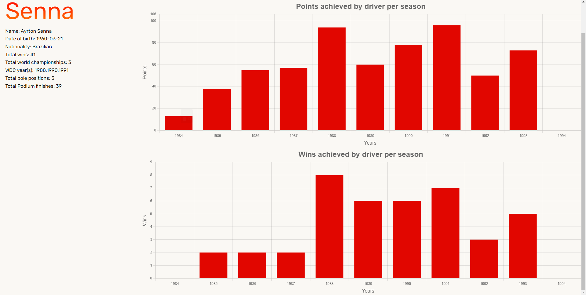

  
<p></p>

# F1 App

Formula 1 app that allows the user to order tickets for grand prix and view F1 related statistics. Created for the Web Technology project for Semester 3.


# Project info and notes

* The F1 api documentation can be found [here](https://documenter.getpostman.com/view/11586746/SztEa7bL)

* The api doesn't contain a lot of qualifying information so there are instances where the information on a drivers profile are incorrect.  
Example:   
  
Ayrton Senna had 65 pole positions in f1 but this data is unavailable.

* The World Tour element fetches a list of countries and its data to draw them, but the names of the countries in the api are not the same in the data of the countries so some might be missing in the tour.

* The api does not contain the colors of the drivers so I used a random color generator to differentiate the drivers in the yearly charts. This color generator can be found [here](https://github.com/davidmerfield/randomColor)  


# Run Locally

Clone the project in the project folder
```bash
  git clone git@git.ti.howest.be:TI/2021-2022/s3/web-technology/students/nicolas-loontjens/project.git
```

Open MariaDB console(sudo mysql -u root -p) and create database
```bash
    create database f1app;
```

Exit the console and in the project directory create .env file
```bash
    cp .env.example .env
```

Edit the .env file and adjust these variables
```bash
    DB_DATABASE=f1app
    DB_USERNAME=dbuser
    DB_PASSWORD=1234
```

Run composer install (if composer install throws errors first run composer update, then composer install)
```bash
    composer install 
```

Generate application key
```bash
    php artisan key:gen
```

Run database migrations
```bash
    php artisan migrate
```

Run database seeder
```bash
    php artisan db:seed --class=TicketTypeSeeder
```

Link the application storage
```bash
    php artisan storage:link
```

Change file permissions
```bash
    sudo chown -R user:www-data storage
    sudo chmod -R ug+rwx storage
```


# Images

All images were either found [here](https://www.reddit.com/r/F1Porn/) or drawn by myself  
<br>
  

